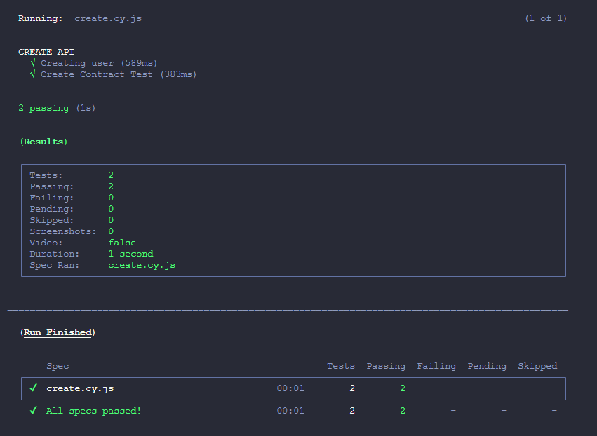

# Repositório do Desafio Reqres - Getnet

Este repositório mantém o código utlizado na automação do desafio.
___

API: https://reqres.in/api/

## Pré-requisito
* Git
* NodeJS
## Clonando o projeto
~~~shell
$ git clone git@github.com:natanlbispo/reqres-desafio.git
~~~
## Rodar o projeto

~~~javascript
$ npm install
~~~

Executando modo Open: 

~~~javascript
$ npm run cypress:open
~~~
    
Executando modo Headless:

~~~javascript
$ npm run cypress:run
~~~

  

---
Responda as questões a seguir:

```
1) O cliente adquiriu um novo modelo de máquina de cartão de crédito e ela aceita as
bandeiras Visa, Master, Elo, Amex e Hiper e executa duas operações para cada
bandeira débito e crédito. Quantos testes serão necessários para validação dessa
máquina e qual técnica a ser utilizada?
```
Teste baseado em checklist seria a técnica utilizada já que é possível saber quais são os casos e condições levam a acerto e falha. 
Fazendo a modelagem dos testes, tentando passar crédito e debito para cada bandeira, depois utilizando casos de falha,para crédito um valor não permitido pelo cartão e para débito um valor acima do saldo, totalizando 20 testes. 

```
1) A bandeira Visa disponibilizou um novo range de bin ́s no mercado que possui seis
dígitos 232425 a 232460. Quais os testes deverão ser feitos desse range de bins para
confirmar que está funcionando?
a) 230000,232425,
b) 0,232425,232460,
c) 232425,232460
d) 232424,232425,232459,232460,
```
R: c) 232425,232460, garante o intervalo permitido e dentro do range.

```
3) Cite uma abordagem desenvolvimento ágil e explique-a, responda em suas palavras.
```
Em busca de melhorar o desenvolvimento dos produtos, muitas equipes optam por adotar o scrum como metodologia ágil, tendo como foco reuniões para alinhamento dos acertos e erros dentro da sprint, além de analisar a capacidade de se adaptar a possíveis mudanças, sejam estas no escopo do projeto ou na equipe.

Todos os ritos são voltados a continua evolução do time e produto. 
```
4) O que é CI/CD?
```
Integração e Entrega contínua são mecanismos de desenvolvimento focado em garantir integração entre o que já foi entregue e o que está desenvolvido gerando builds assim garantindo uma entrega eficiente. É comum na parte de CI(Integração contínua) ter fluxos de automatizados de testes, assim como integração de de features desenvolvidas por pessoas diferentes para que na CD(Entrega contínua) resulte em um produto.
```
5) O que é TDD, BDD e ATDD e quando são aplicadas?
```
TDD, BDD, ATDD são técnicas para ajudar a equipe que está desenvolvendo o software a garantir qualidade na sua entrega. TDD é empregado na etapa de desenvolvimento onde principalmente desenvolvedores vão planejando e escrevendo testes unitários a fim de garantir segurança da função que será feita, o BDD é empregado em todo o processo do desenvolvimento, onde todos do time tem uma visão única do que será construído, por tanto reuniões de alinhamento sobre regras de negócio são importante e tanto DEVs, QAs e POs, geralmente refinamentos ajudam nessa parte. ATDD está associado ao envolvimento de clientes na construção e entrega do produto onde por MVPs ou reuniões são mostradas as features desenvolvidas para serem aprovadas ou ajustadas às necessidades que o software precisa ter.  

```
6) Cite uma heurística de testes utilizada para testes de front e de back e explique-as
```
Começando pela heurística mais utilizada CRUD, onde ao testar principais partes, adicionando ou retirando elementos, fazendo o update e já verificando de back e front respondem bem e em sincronia com as ações testadas, depois passando pela heurística de testar limites permitidos pela aplicação, assim observando mensagens de erros que deveriam ser mostradas e começando os testes por partes mais críticas do software.

```
1) Cite ferramentas de testes automatizados para Desktop, Web, API ́s e mobile
```

Mobile: Appium + WD.js , Appium+WebdriverIO, RobotFramework;

API: Cypress, Rest-Assured, K6, Postman;

WEB: Cypress, Selenium, Playwright;

Desktop: RobotFramework;

---
Prática de API

```
Desenvolva o script da automação seguindo as informações a seguir:
```
```
Documentação = https://reqres.in/
```
```
URI = https://reqres.in/api
```
```
1) Validar o script de "CREATE" método "POST” cobertura de testes em Rest-
Assured da API
2) Validar cobertura de Status Code, Campos obrigatórios e Contrato
3) Desenvolver com POJOs.
```
```
OBS 1 : Enviar o link do código no GitHub
```

